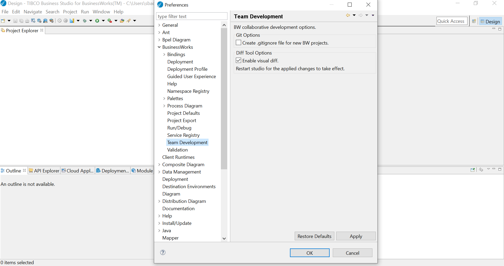
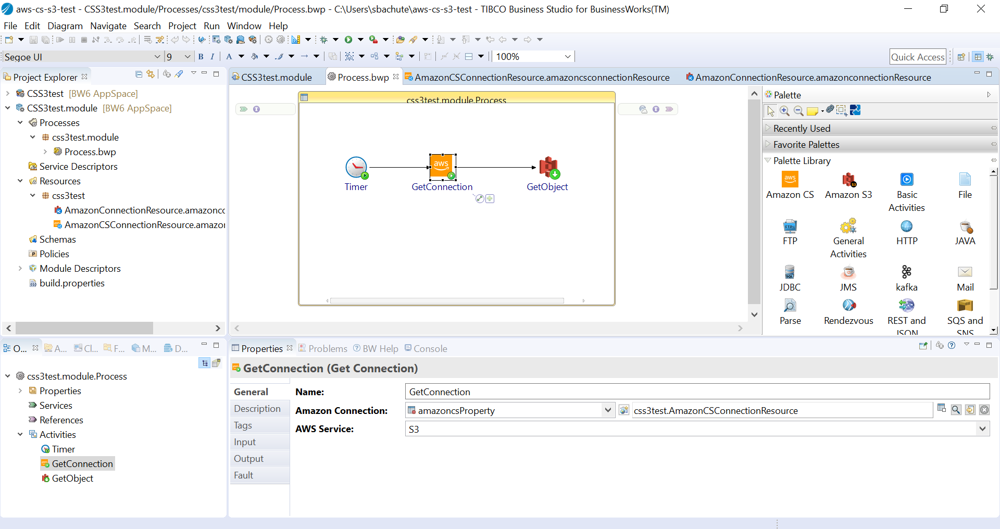
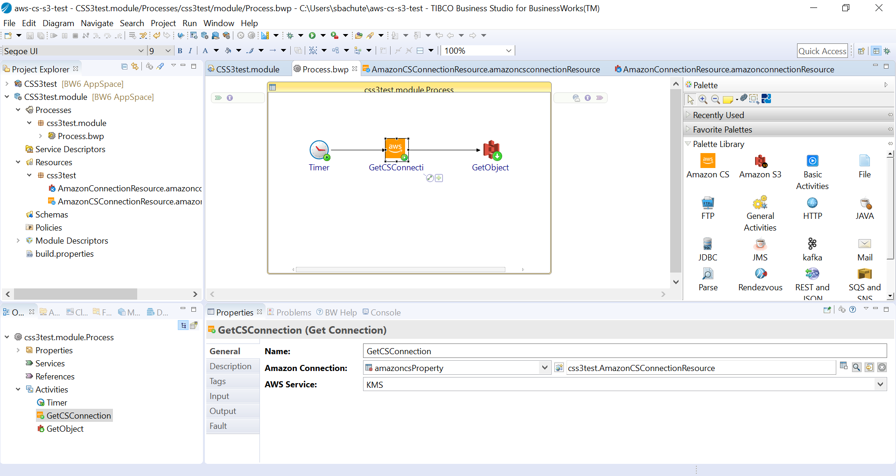
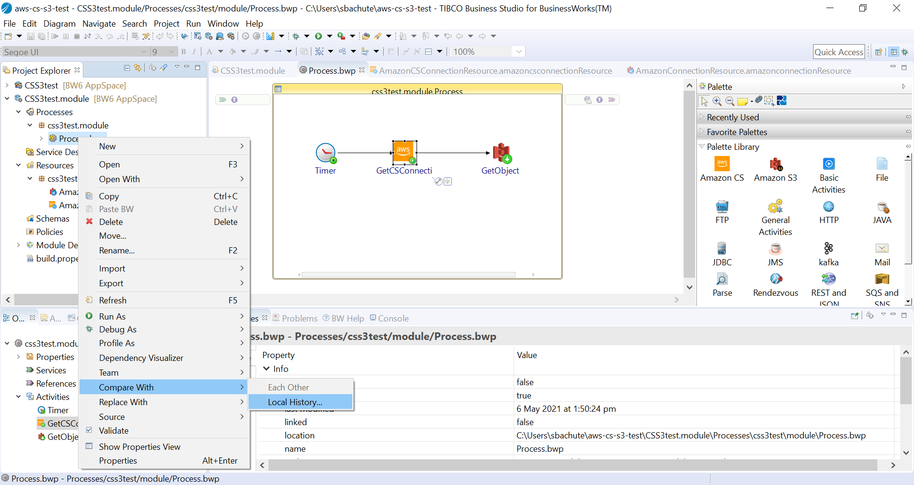
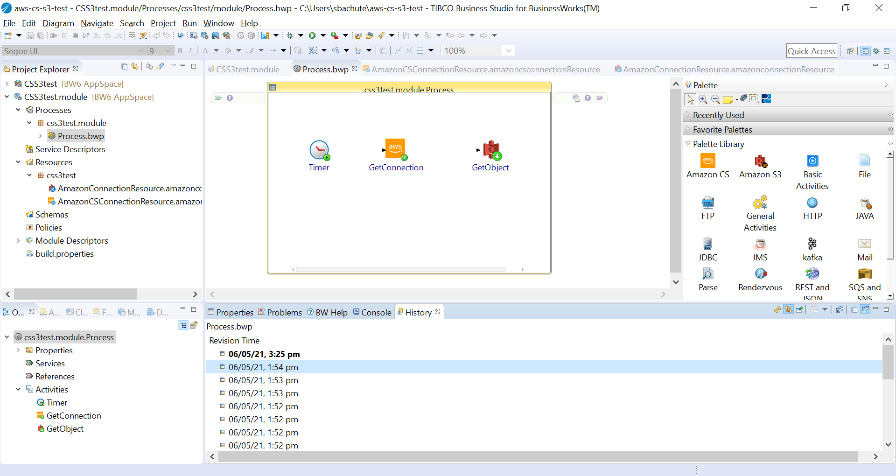
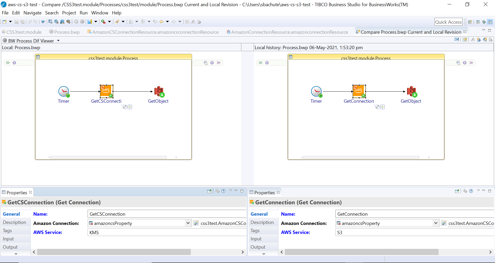

#Visual diff viewer metadata JSON for Big Data Plugin
This feature enables the user to understand the changes in BW application process by comparing the process with its previous revisions. 
JSON file contains the mappings to process properties of a palette activity. The JSON files in this repository will enable the user to compare the local revisions 
for Big Data plugin(Hadoop, HDFS and Oozie palette).

## Prerequisites
1. Visual diff Tool should be enabled either on TIBCO ActiveMatrix BusinessWorks™ or TIBCO BusinessWorks™ Container Edition.
2. Either of TIBCO ActiveMatrix BusinessWorks™ or TIBCO BusinessWorks™ Container Edition should be installed.

##Setup 

###1.Enabling Visual Diff
 Goto Windows > Preferences > Business Works > Team Development > Enable visual diff.
	

###2.Copy the JSON files files to the following location:
	
	TIBCO_HOME > bw > 6.8 > system > mappings > palettes
	
	If mappings folder is not present, refer the following:
	a. Create mappings folder.
	b. Create palettes folder under mappings and paste the metadata JSON files.

##Test JSON files by comparing with local revision
1. Create a sample BW application process and save the application.
	
2. Edit the properties section of an activity and save the application.
	
3. Right click on the BW process and goto Compare with > Local History.
	
4. Compare the local revision with a previous revision. 
	
	
